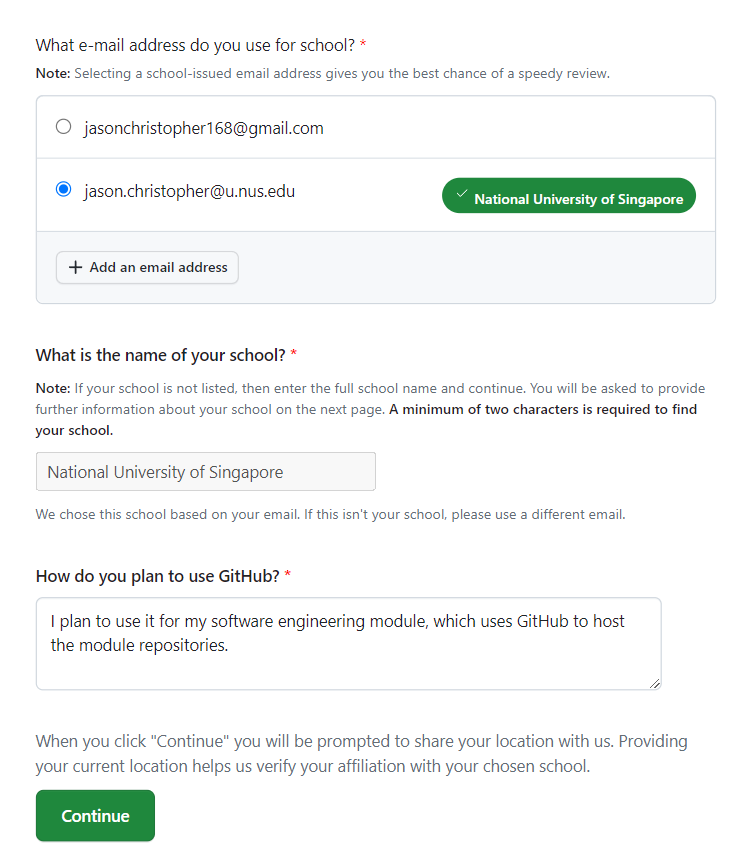
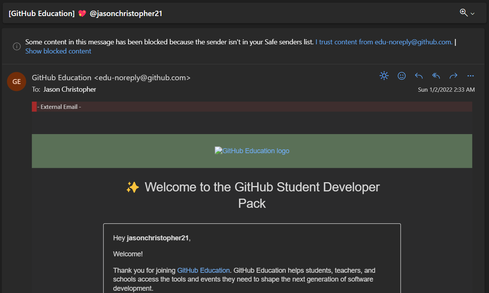

import ReactPlayer from 'react-player'

# Git Workshop Prerequisites

Date: Saturday, 14 October 2023 <br />
Time: 10.30 - 12.00 <br />
Venue: CommIT Lab (AS8 Level 2) <br />

## Topics Covered

This pre-workshop materials covers the following items:

- Creating a GitHub account
- Signing up for GitHub Student Developer Pack
- Installing Git
- Configuring Git on your computer

## GitHub Account

_You are free to skip this section if you already have a GitHub account_

### Creating a GitHub Account

1. Head over to [github.com](https://github.com) and choose "Sign Up"
2. Follow the instructions, and create your email **using your NUS email**
3. Complete the instructions and you are good to go!

### GitHub Student Developer Pack

As a student, you are eligible for a free GitHub Pro account and also other exciting offers. To better enhance your productivity, we recommend you to sign up for this free GitHub Pro account.

Steps:

1. Head over to [education.github.com/pack](https://education.github.com/pack).
2. Sign in to your GitHub account that was created using the NUS account.
3. Fill in a request for a GitHub student account. Here is an example of a form that you can fill in.



:::info
It is important for you to select the school email, because this provides more credential, and giving a stronger case for the approval of your GitHub student developer account. _(Yes, I got rejected once because of using my personal email oof)_
:::

4. Once you submitted, it might take some time until it is approved. Once approved, your account would be granted the PRO access. You will receive an email once your request is approved.



## Installing Git

The next step is to install Git on your computer.

### Windows Users

1. Download the Git installer for Windows from the official site: [Git for Windows](https://git-scm.com/download/win)
2. Run the installer with the default settings. You can choose to customise the installation if you have specific preferences, but for most users, the default settings are sufficient. 
3. During the installation, you will be prompted to select the text editor you want to use with Git. You can choose your preferred text editor, ro you can go with the default option (e.g. Vim or Nano. Vim is recommended for starters).
4. After your installation is complete, Git is now already installed in your computer, and all it needs is to configure your GitHub account.

### MacOS Users

MacOS typically comes with Git pre-installed. However, it's a good idea to ensure that you have the latest version by following these steps:

1. Open the Terminal. You can find it in the Applications folder under Utiliites or search for it using Spotlight.
2. Check if Git is installed and view the version. You can run the following command:

```bash
git --version
```

If Git is not installed, macOS will prompt you to install the Command Line Tools for Xcode. Follow the on-screen instructions to complete the installation.

## Configuring Git

Now that Git is installed, we can configure the Git username and email, based on your GitHub credentials.

### Open the Terminal

For windows users, open 'Git Bash' terminal, which is a command-line interface for Git. You can find it in your Start menu.

For macOS users, this is integrated in your "Terminal" app.

### Configure Git on your Computer

Set your Git username and email. On Git Bash / Terminal, enter the following command:

```bash
git config --global user.name "Your Name"
git config --global user.email "your.email@example.com"
```

Replace `"Your Name"` and `"your.email@example.com"` with your own name and your email address.

Once you are done, you are good to go!

### Video Tutorial

If you need a quickie tutorial, you can refer here!

<ReactPlayer playing controls url='https://youtu.be/xNmEbA3SKJw' />

## (Optional) Don't wanna use Git CLI?

Other options are available! Some examples:
- [SourceTree](https://www.sourcetreeapp.com/)
- [GitKraken](https://www.gitkraken.com/github-student-developer-pack-bundle?utm_feeditemid=&utm_device=c&utm_term=git%20gui&utm_campaign=GK+Git+GUI+-+Search+(EN)&utm_source=google&utm_medium=ppc&hsa_acc=1130375851&hsa_cam=18519961346&hsa_grp=145767943327&hsa_ad=626305507890&hsa_src=g&hsa_tgt=kwd-7581169389&hsa_kw=git%20gui&hsa_mt=b&hsa_net=adwords&hsa_ver=3&gclid=Cj0KCQjw1aOpBhCOARIsACXYv-fW5HHoPXXDH8cSD_xwtHeVuu1qxN3SQsZ6QiCBSUjCPvlvFv8kn3saAmJEEALw_wcB) (Free for students with GitHub student pack)
- [GitHub Desktop](https://desktop.github.com/)
- [VSCode Built-in Source Control](https://code.visualstudio.com/docs/sourcecontrol/overview)

I (Jason) personally use VSCode's Built-in Source Control xD ez to push things directly to Git haha. However, some people would benefit from visualising how the branches and commits are changing over time. In that case, I would recommend SourceTree / GitKraken.

Hardcore programmers can stick to Git CLI :)

## (Optional) SSH Keys

If you need extra layer of security, you may want to look over this document: 

[Adding a new SSH key to your GitHub account](https://docs.github.com/en/authentication/connecting-to-github-with-ssh/adding-a-new-ssh-key-to-your-github-account)
