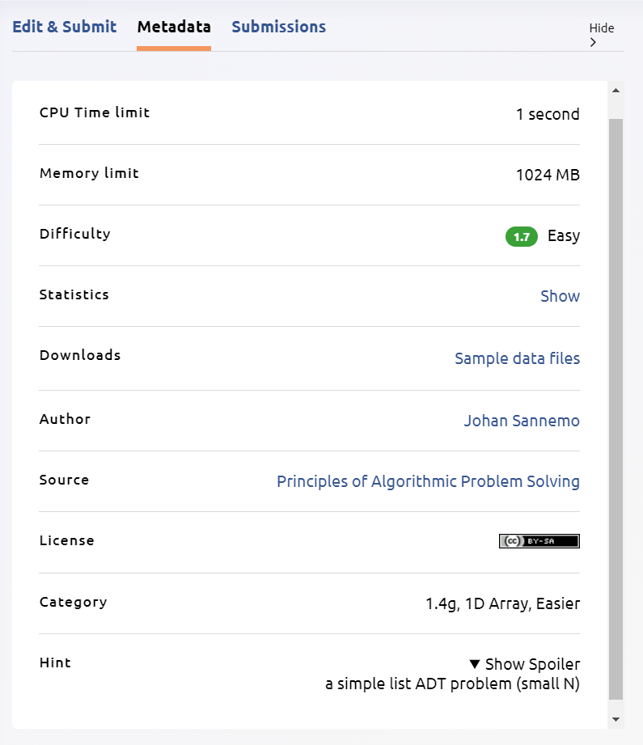

# Week 3: Cut in Line

## Problem Statement

[open.kattis.com/problems/cutinline](https://open.kattis.com/problems/cutinline)

## Goal

This is actually the first hands-on problem of the entire module, so the goal is to get you up to speed with how our hands-on session work :).

Furthermore, if you're kaypoh, you can also check the problem metadata. You can see that it is an easy problem, and even CP4 books' methods to solve also mentions that it is quite an easy array problem.



## Intuition

This problem is basically simulating a "queue" in Java. This supports two main operations:

- `cut`: `cut a b` allows `a` to be inserted in front of `b` in the queue.
- `leave`: `leave a` allows `a` to leave the queue.

However, here comes the problem:

### Problem with `cut` and `leave`

Suppose the queue is `a b c d e`, then you want to execute `cut f b`. Then, all positions from `b` to `e` must be shifted to the right!

Same goes with if you have `a b c d e`, then you want to execute `leave a`. Then, all positions from `b` to `e` must be shifted to the left.

## Solution

To mitigate this, there are two ways we can do:

### Sol 1: Manual array shift

If we know the maximum size of the array needed, then we can simply create a static array, and implement our shift manually. 

This is a quick _uncompleted_ code that covers the case of `cut`:

```java title="cutinline.java"
import java.util.*;
import java.io.*;

public class cutinline {
    public static void main(String[] args) throws IOException {
        // Setup I/O methods
        BufferedReader br = new BufferedReader(new InputStreamReader(System.in));
        PrintWriter pw = new PrintWriter(System.out);

        // Setup line for queueing. Note that 0 <= N <= 1000 and 0 <= C <= 1000,
        // so we can safely set the size of the array to 2000.
        String[] line = new String[2000];
        int lastPersonIndex = 0;

        // Setup the initial line
        int N = Integer.parseInt(br.readLine());
        for (int i = 0; i < N; i++) {
            line[i] = br.readLine();
            lastPersonIndex++;
        }

        // Perform Commands
        int C = Integer.parseInt(br.readLine());

        while (C-- > 0) {
            String[] command = br.readLine().split(" ");

            // Cut command
            if (command[0].equals("cut")) {
                String cutter = command[1];
                String poorGuy = command[2];
                
                int personPointer = 0;

                // Find where the poor guy is located
                for (String person : line) {
                    if (person.equals(poorGuy)) {
                        break;
                    }
                    personPointer++;
                }

                // Shift everyone after poor guy by one position
                for (int i = lastPersonIndex; i >= personPointer; i--) {
                    line[i + 1] = line[i];
                }

                // Place the cutter in the poor guy's position
                line[personPointer] = cutter;
                lastPersonIndex++;
            }
        }

        // Print the final line
        for (int i = 0; i < lastPersonIndex; i++) {
            pw.println(line[i]);
        }
        
        pw.flush();
        br.close();
    }
}
```

### Sol 2: Dynamic Arrays

Instead of manually shifting the items around, what if we can just use a Java default implementation?

Let us use ArrayList instead!

<iframe src="https://docs.oracle.com/javase/8/docs/api/java/util/ArrayList.html" width="720" height="360" />

### Sol 3: Linked Lists

A bit overkill :") but will be seen in the join strings hands-on problem