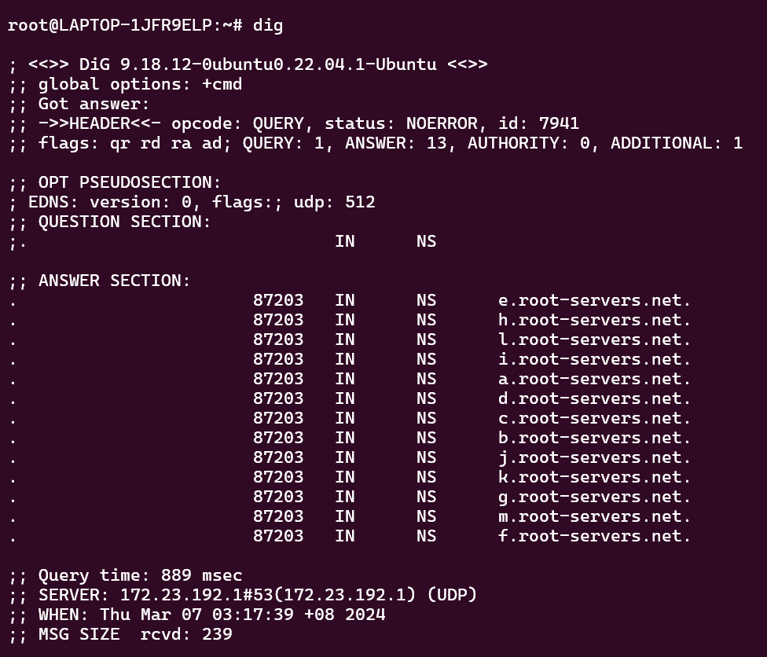

# Programs and Commands

The following lists the commands and programs that are introduced in CS2105. For some of these programs, you are required to just know when and why it is used, whereas for more complex commands, deeper understanding of the command usage and output is required.

:::caution
This page does not include socket programming and assignment questions/implementations. Please refer to the lecture slides and your assignment submission for these resources.
:::

## `traceroute`

### What, when, why

From it's name, it tells you that it is tracing the route to some domain or IP address, and what the maximum number of hops will be before it times out.

The "trace" in "traceroute" means that it provides information about each router that it passes through on the way to the destination.

### Protocol

`traceroute` command uses ICMP (Internet Control Message Protocol)

### Usage

You can use traceroute with an IP address or domain name

```
traceroute [IP Address/Domain Name]
```

### Sample


### Reading Outputs

One of the best things about the traceroute tool is that once you learn how to read the results, you can understand the information it provides with just a quick glance. When you look at the example results of the traceroute listed above, you will see several key pieces of information.

Let us examine a row. A row usually contains four columns:

- **Hop Number**: The first column just tells you which hop the trace is on. It stores the IP address of the current node

- **Round Trip Time**: The next three columns show the amount of time it took data to go from the source (typically your computer) to that hop and back. This is measured in milliseconds. There are three columns, because when we run the `traceroute` command, we send the data to each hop three times.

The most common issue you will see with a traceroute is a timeout response, which is represented by an asterisk (\*). These happen quite frequently and for a variety of different reasons. In the following example, you can see multiple hops have asterisks when attempting to run a traceroute to google.com.

When you see an asterisk, it will mean one of the following things:

- Single Asterisk on a Hop: This means that the request timed out on just one of the three attempts. This can be a sign that there is an intermittent problem at that hop.
- Three Asterisks, Then Failure: If you see all three attempts at a hop have asterisks and then the traceroute errors out, it means that the hop is completely down.
- Three Asterisks, Then Success: If you see three attempts at a hop failing but then the rest of the traceroute continues without an issue, that is actually not a problem at all. This simply means that (as mentioned earlier) the device at that hop is configured not to respond to pings or traceroutes so the attempt times out.

Now, let us examine how the rows are structured.

- Row number 1 is usually the internet gateway on the network this `traceroute` was done from. In the image above, it starts from the local computer.
- The next few routers are likely part of the ISP that the origin computer is connected to.
- The next few are likely global gateways.
- We will then see that we will head towards the destination's local ISP.
- Finally, we will get a router on the network that the domain is hosted on, and lastly the host that the domain is hosted on directly (if the maximum number of hops is not yet exceeded)

## `nslookup`

### What, when, why

`nslookup` is used to find the IP address that corresponds to a host, or the domain name that correspons to an IP address (a process called "Reverse DNS Lookup").

### Protocol

Uses UDP by default.

May also use TCP (Transmission Control Protocol) if the DNS response is too large to fit in a single UDP packet, as TCP allows for larger data transmission. This is often the case when querying for DNS resource records such as DNSSEC-related records or when dealing with zone transfers.

### Usage

- Performing a basic DNS lookup: `nslookup example.com`
- Performing a reverse DNS lookup: `nslookup (IP Address)`
- View a domain's SOA records: `nslookup -type=soa [domain-name]`
- Check the SOA records of a domain: `nslookup -type=ns example.com`
- Look up a specific type of record: `nslookup -type=record_type domain_name` where `record_type` is A, CNAME, MX, PTR, NS, or ANY

### Sample

```
~# nslookup www.yahoo.com
Server:         172.23.192.1
Address:        172.23.192.1#53

Non-authoritative answer:
www.yahoo.com   canonical name = me-ycpi-cf-www.g06.yahoodns.net.
Name:   me-ycpi-cf-www.g06.yahoodns.net
Address: 106.10.236.37
Name:   me-ycpi-cf-www.g06.yahoodns.net
Address: 180.222.114.12
Name:   me-ycpi-cf-www.g06.yahoodns.net
Address: 180.222.114.11
Name:   me-ycpi-cf-www.g06.yahoodns.net
Address: 106.10.236.40
Name:   me-ycpi-cf-www.g06.yahoodns.net
Address: 2406:6e00:108:fe06::2000
Name:   me-ycpi-cf-www.g06.yahoodns.net
Address: 2406:6e00:108:fe06::3000
```

### Reading Outputs

Let us start by dissecting the first two lines of the output:

```
~# nslookup www.yahoo.com
Server:         172.23.192.1
Address:        172.23.192.1#53
```

The first two addresses that are provided are the IP address of your **DNS server**

Then, we start by dissecting the next few lines of the output:

```
Non-authoritative answer:
www.yahoo.com   canonical name = me-ycpi-cf-www.g06.yahoodns.net.
Name:   me-ycpi-cf-www.g06.yahoodns.net
Address: 106.10.236.37
Name:   me-ycpi-cf-www.g06.yahoodns.net
Address: 180.222.114.12
Name:   me-ycpi-cf-www.g06.yahoodns.net
Address: 180.222.114.11
Name:   me-ycpi-cf-www.g06.yahoodns.net
Address: 106.10.236.40
Name:   me-ycpi-cf-www.g06.yahoodns.net
Address: 2406:6e00:108:fe06::2000
Name:   me-ycpi-cf-www.g06.yahoodns.net
Address: 2406:6e00:108:fe06::3000
```

:::info
An **authoritative answer** comes from a nameserver that is considered authoritative for the domain which it's returning a record for (one of the name servers in the list for the domain you did a lookup on).

This answer is said to be **non-authoritative** because it is provided from anywhere else (i.e. a nameserver not in the list for the domain you did a lookup on)
:::

- Name shows the domain name queried (`me-ycpi-cf-www.g06.yahoodns.net`).
- Address displays the IP address associated with the domain name (`106.10.236.37`).

:::note
Notice that the last two addresses are using IPv6 format instead of IPv4 format
:::

## `dig`

:::tip Did you know?
`dig` stands for Domain Information Groper
:::

### What, when, why

dig is a network administration command-line tool for querying the Domain Name System. dig is useful for network troubleshooting and for educational purposes. It can operate based on command line option and flag arguments, or in batch mode by reading requests from an operating system file. 

In a sense this is similar to `nslookup`, except that it interrogates more of the DNS servers, and also returns the corresponding DNS records to the domain name.

### Protocol

Same as `nslookup`, `dig` uses UDP by default (it is specified in the `dig` response usually)

### Usage and Sample

A simple way to use `dig` command is to just specify the domain name

```txt title="Simple dig with domain name"
dig [DOMAIN NAME]
```

```txt title="Example: Query for www.yahoo.com"
dig www.yahoo.com
```

We can also add other flags, for instance, the type (`-t`) flag:

```txt title="dig example with type"
dig -t [TYPE] [DOMAIN NAME]
```

```txt title="Example: Retrieving only the address (A) DNS records corresponding to www.yahoo.com"
dig -t a www.yahoo.com
```

For the types, we can choose from the following DNS record types:

| DNS Record Type | Description                                                                             |
| --------------- | --------------------------------------------------------------------------------------- |
| A               | Maps domain names to IPv4 addresses                                                     |
| AAAA            | Maps domain names to IPv6 addresses                                                     |
| CNAME           | Redirects a domain to a different domain                                                |
| PTR             | Resolves IPv4 or IPv6 addresses to domain names                                         |
| NS              | Provides a list of the authoritative name servers responsible for the domain            |
| MX              | Provides the domain names of the mail servers that receive emails on behalf of a domain |
| SOA             | Provides important details of a DNS zone, required for every DNS zone                   |

There are also other flags which might be out of the scope for this module. Some examples

- `-x`: Performs a reverse DNS lookup, that is, given an IP address, we want to find what is the domain name. Similar to the `PTR` type. Example: `dig -x 172.217.14.238`
- `+noall`, `+nostats`: disables everything from the answer / disables the stats from the answeer

### Reading outputs

An example is from the past year midterm papers:

```txt title="Sample DiG output"
; <<>> DiG 9.6-ESV-R11-S10 <<>> a www.yahoo.com
;; global options: +cmd
;; Got answer:
;; ->>HEADER<<- opcode: QUERY, status: NOERROR, id: 7897
;; flags: qr rd ra; QUERY: 1, ANSWER: 3, AUTHORITY: 4, ADDITIONAL: 4

;; QUESTION SECTION:
;www.yahoo.com. IN A

;; ANSWER SECTION:
www.yahoo.com. 60 IN CNAME new-fp-shed.wg1.b.yahoo.com.
new-fp-shed.wg1.b.yahoo.com. 60 IN A 202.165.107.50
new-fp-shed.wg1.b.yahoo.com. 60 IN A 202.165.107.49

;; AUTHORITY SECTION:
wg1.b.yahoo.com. 96586 IN NS yf3.a1.b.yahoo.net.
wg1.b.yahoo.com. 96586 IN NS yf4.a1.b.yahoo.net.
wg1.b.yahoo.com. 96586 IN NS yf1.yahoo.com.
wg1.b.yahoo.com. 96586 IN NS yf2.yahoo.com.

;; ADDITIONAL SECTION:
yf1.yahoo.com.      1263 IN A 68.142.254.15
yf2.yahoo.com.      1263 IN A 68.180.130.15
yf3.a1.b.yahoo.net. 1263 IN A 106.10.210.152
yf4.a1.b.yahoo.net. 1263 IN A 68.180.130.15

;; Query time: 233 msec
;; SERVER: 137.132.85.2#53(137.132.85.2)
;; WHEN: Thu Mar 31 17:02:59 SGT 2022
;; MSG SIZE rcvd: 245
```

Let us try to digest the output one by one

```txt title="DiG Header"
; <<>> DiG 9.6-ESV-R11-S10 <<>> a www.yahoo.com
;; global options: +cmd
;; Got answer:
;; ->>HEADER<<- opcode: QUERY, status: NOERROR, id: 7897
;; flags: qr rd ra; QUERY: 1, ANSWER: 3, AUTHORITY: 4, ADDITIONAL: 4
```

This DiG Header shows some statuses about the dig query. 

- Here, it specifies the query input, that is, `a www.yahoo.com`. This tells us that the `dig` command was `dig -t a www.yahoo.com`
- `flags: qr rd ra` is kind of the settings that is provided to the `dig` command. Here are a list of such flags:
  - AA = Authoritative Answer
  - TC = Truncation
  - RD = Recursion Desired (set in a query and copied into the response if recursion is supported)
  - RA = Recursion Available (if set, denotes recursive query support is available)
  - AD = Authenticated Data (for DNSSEC only; indicates that the data was authenticated)
  - CD = Checking Disabled (DNSSEC only; disables checking at the receiving server)
- `status: NOERROR` tells us that the query was successful. Here are a list of such statuses:
  - 0 = NOERR, no error
  - 1 = FORMERR, format error (unable to understand the query)
  - 2 = SERVFAIL, name server problem
  - 3 = NXDOMAIN, domain name does not exist 
  - 4 = NOTIMPL, not implemented
  - 5 = REFUSED (e.g., refused zone transfer requests)
- `QUERY: 1, ANSWER: 3, AUTHORITY: 4, ADDITIONAL: 4` tells us that there is one query, 3 records in the ANSWER section, 4 records in the AUTHORITY section, and 4 records in the ADDITIONAL section.

```txt title="QUESTION section"
;; QUESTION SECTION:
;www.yahoo.com. IN A
```

The **QUESTION** section tells us about what is the query that is provided to the `dig` command

```txt title="ANSWER section"
;; ANSWER SECTION:
www.yahoo.com. 60 IN CNAME new-fp-shed.wg1.b.yahoo.com.
new-fp-shed.wg1.b.yahoo.com. 60 IN A 202.165.107.50
new-fp-shed.wg1.b.yahoo.com. 60 IN A 202.165.107.49
```

The **ANSWER** section provides the answer to the specified query, i.e. this is your output. Since the query is to specifically seek for the address of the domain name (i.e. the `A` records), thus the answer section will contain the `A` records corresponding to the domain name.

- The first record tells us that `www.yahoo.com` has a canonical name
- The second and third records have a `A` type, which tells us that the DNS record is the address that hosts `new-fp-shed.wg1.b.yahoo.com`, which is the alias of `www.yahoo.com`

If `+noanswer` flag is added to the query, then this section will not show up. The default is to display this seciton.


```txt title="AUTHORITY section"
;; AUTHORITY SECTION:
wg1.b.yahoo.com. 96586 IN NS yf3.a1.b.yahoo.net.
wg1.b.yahoo.com. 96586 IN NS yf4.a1.b.yahoo.net.
wg1.b.yahoo.com. 96586 IN NS yf1.yahoo.com.
wg1.b.yahoo.com. 96586 IN NS yf2.yahoo.com.
```

The **AUTHORITY** section displays the DNS name server that has the authority to respond to this query. Basically this displays available name servers of www.yahoo.com (you can check that each record here has an `NS` type).

If `+noauthority` flag is added to the query, then this section will not show up. The default is to display this section.


```txt title="ADDITIONAL section"
;; ADDITIONAL SECTION:
yf1.yahoo.com.      1263 IN A 68.142.254.15
yf2.yahoo.com.      1263 IN A 68.180.130.15
yf3.a1.b.yahoo.net. 1263 IN A 106.10.210.152
yf4.a1.b.yahoo.net. 1263 IN A 68.180.130.15
```

The **ADDITIONAL** section displays the IP address of the name servers listed in the AUTHORITY SECTION.

If `+noadditional` flag is added to the query, then this section will not show up. The default is to display this section.


```txt title="STATS section"
;; Query time: 233 msec
;; SERVER: 137.132.85.2#53(137.132.85.2)
;; WHEN: Thu Mar 31 17:02:59 SGT 2022
;; MSG SIZE rcvd: 245
```

The **stats** section shows the statistics of the query:
- The query time can be used to check whether someone has recently accessed a webpage from your organisation. This is because if someone has recently accessed it, then the query time would be **_relatively_** lower than a fresh search.
- The `SERVER` section here shows the DNS server that responds to the query (usually the local DNS server)

### Fun fact: `dig` nothing?

:::tip Question

Can you run `dig` command without specifying anything?

:::

Funny enough, yes! You can run the `dig` command without specifying anything. Unlike most commands which displays some kind of a usage instructions, if you run `dig` command without specifying any domain name, it will query out the root name servers!



## `ping`

### What, when, why

It sends packets of data to a specific IP address on a network, and then lets you know how long it took to transmit the data and get a response.

### Protocol

`ping` uses the echo request and echo reply messages within ICMP (Internet Control Message Protocol)

### Usage

```
ping [DOMAIN NAME / IP ADDRESS]
```

When a `ping` command is used, an echo request packet is sent to the address specified. When the remote host receives the echo request, it responds with an echo reply packet

### Reading Outputs

```
root@LAPTOP-1JFR9ELP:~# ping google.com
PING google.com (172.253.118.138) 56(84) bytes of data.
64 bytes from sl-in-f138.1e100.net (172.253.118.138): icmp_seq=1 ttl=100 time=5.31 ms
64 bytes from sl-in-f138.1e100.net (172.253.118.138): icmp_seq=2 ttl=100 time=21.5 ms
64 bytes from sl-in-f138.1e100.net (172.253.118.138): icmp_seq=3 ttl=100 time=22.7 ms
64 bytes from sl-in-f138.1e100.net (172.253.118.138): icmp_seq=4 ttl=100 time=5.72 ms
64 bytes from sl-in-f138.1e100.net (172.253.118.138): icmp_seq=5 ttl=100 time=5.47 ms
64 bytes from sl-in-f138.1e100.net (172.253.118.138): icmp_seq=6 ttl=100 time=23.4 ms
64 bytes from sl-in-f138.1e100.net (172.253.118.138): icmp_seq=7 ttl=100 time=28.5 ms
64 bytes from sl-in-f138.1e100.net (172.253.118.138): icmp_seq=8 ttl=100 time=20.2 ms
64 bytes from sl-in-f138.1e100.net (172.253.118.138): icmp_seq=9 ttl=100 time=54.7 ms
64 bytes from sl-in-f138.1e100.net (172.253.118.138): icmp_seq=10 ttl=100 time=6.49 ms
--- google.com ping statistics ---
10 packets transmitted, 10 received, 0% packet loss, time 9015ms
rtt min/avg/max/mdev = 5.311/19.395/54.746/14.525 ms
```

The output seems quite intuitive:
- Each row corresponds to how long it takes to send and receive 64 bytes of data
- In the end, we have the statistics of the RTT to reach the specified domain name

## `telnet`

### What, when, why

Telnet is a computer protocol that was built for interacting with remote computers. It is one of the simplest ways to check connectivity on certain ports

### Protocol

Telnet runs on top of  TCP, specifically to port number 23 or 2323, where a Telnet server application is listening.

### Usage

```
telnet [ host [ port ] ]
```

### Sample

```
telnet www.comp.nus.edu.sg
```

### Reading outputs

There are several possibilities here (referencing some online photos because I couldn't find a working telnet server to connect to)

1. Successful connection:

    

2. Blocked by a firewall that is rejecting connection

    

3. Infinite loading

    

    There are several scenarios that may lead to this problem: it could be that
    - a network or host firewall is dropping incoming connections
    - the remote is down
    - network connectivity between the client and server is unavailable for some reason.

## Acknowledgements

Adapted from the brilliant summary written by [Zhu Hanming](https://github.com/zhuhanming) on his [cheatsheet](https://github.com/zhuhanming/nus-notes-cheatsheets/blob/master/cs2105/CS2105%20Cheatsheet.pdf) published on GitHub.

Other references:

- [https://www.catchpoint.com/network-admin-guide/how-to-read-a-traceroute](https://www.catchpoint.com/network-admin-guide/how-to-read-a-traceroute)
- [https://bluecatnetworks.com/blog/know-the-eight-most-common-dns-records/](https://bluecatnetworks.com/blog/know-the-eight-most-common-dns-records/)
- [https://en.wikipedia.org/wiki/Dig_(command)](https://en.wikipedia.org/wiki/Dig_(command))
- [https://www.cyberciti.biz/faq/linux-unix-dig-command-examples-usage-syntax/](https://www.cyberciti.biz/faq/linux-unix-dig-command-examples-usage-syntax/)
- [https://www.ibm.com/docs/pl/aix/7.1?topic=d-dig-command](https://www.ibm.com/docs/pl/aix/7.1?topic=d-dig-command)
- [https://serverfault.com/questions/729025/what-are-all-the-flags-in-a-dig-response](https://serverfault.com/questions/729025/what-are-all-the-flags-in-a-dig-response)
- [https://netbeez.net/blog/telnet-to-test-connectivity-to-tcp/](https://netbeez.net/blog/telnet-to-test-connectivity-to-tcp/)