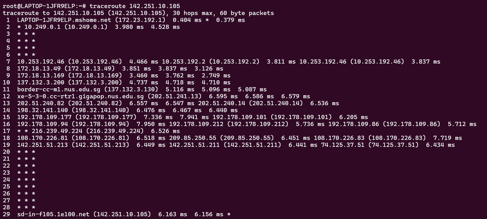

# Programs and Commands

The following lists the commands and programs that are introduced in CS2105. For some of these programs, you are required to just know when and why it is used, whereas for more complex commands, deeper understanding of the command usage and output is required.

:::caution
This page does not include socket programming and assignment questions/implementations. Please refer to the lecture slides and your assignment submission for these resources.
:::

## `traceroute`

### What, when, why

From it's name, it tells you that it is tracing the route to some domain or IP address, and what the maximum number of hops will be before it times out.

The "trace" in "traceroute" means that it provides information about each router that it passes through on the way to the destination.

### Usage

You can use traceroute with an IP address or domain name

```
traceroute [IP Address/Domain Name]
```

### Sample



### Reading Outputs

One of the best things about the traceroute tool is that once you learn how to read the results, you can understand the information it provides with just a quick glance. When you look at the example results of the traceroute listed above, you will see several key pieces of information.

Let us examine a row. A row usually contains four columns:

- **Hop Number**: The first column just tells you which hop the trace is on. It stores the IP address of the current node

- **Round Trip Time**: The next three columns show the amount of time it took data to go from the source (typically your computer) to that hop and back. This is measured in milliseconds. There are three columns, because when we run the `traceroute` command, we send the data to each hop three times. 

The most common issue you will see with a traceroute is a timeout response, which is represented by an asterisk (*). These happen quite frequently and for a variety of different reasons. In the following example, you can see multiple hops have asterisks when attempting to run a traceroute to google.com.

When you see an asterisk, it will mean one of the following things:

- Single Asterisk on a Hop: This means that the request timed out on just one of the three attempts. This can be a sign that there is an intermittent problem at that hop.
- Three Asterisks, Then Failure: If you see all three attempts at a hop have asterisks and then the traceroute errors out, it means that the hop is completely down.
- Three Asterisks, Then Success: If you see three attempts at a hop failing but then the rest of the traceroute continues without an issue, that is actually not a problem at all. This simply means that (as mentioned earlier) the device at that hop is configured not to respond to pings or traceroutes so the attempt times out.

Now, let us examine how the rows are structured.

- Row number 1 is usually the internet gateway on the network this `traceroute` was done from. In the image above, it starts from the local computer.
- The next few routers are likely part of the ISP that the origin computer is connected to.
- The next few are likely global gateways.
- We will then see that we will head towards the destination's local ISP.
- Finally, we will get a router on the network that the domain is hosted on, and lastly the host that the domain is hosted on directly (if the maximum number of hops is not yet exceeded)

### Protocol

`traceroute` command uses ICMP (Internet Control Message Protocol)

## `nslookup`

### What, when, why

`nslookup` is used to find the IP address that corresponds to a host, or the domain name that correspons to an IP address (a process called "Reverse DNS Lookup"). 

### Usage

- Performing a basic DNS lookup: `nslookup example.com`
- Performing a reverse DNS lookup: `nslookup (IP Address)`
- View a domain's SOA records: `nslookup -type=soa [domain-name]`
- Check the SOA records of a domain: `nslookup -type=ns example.com`
- Look up a specific type of record: `nslookup -type=record_type domain_name` where `record_type` is A, CNAME, MX, PTR, NS, or ANY

### Sample

```
~# nslookup www.yahoo.com
Server:         172.23.192.1
Address:        172.23.192.1#53

Non-authoritative answer:
www.yahoo.com   canonical name = me-ycpi-cf-www.g06.yahoodns.net.
Name:   me-ycpi-cf-www.g06.yahoodns.net
Address: 106.10.236.37
Name:   me-ycpi-cf-www.g06.yahoodns.net
Address: 180.222.114.12
Name:   me-ycpi-cf-www.g06.yahoodns.net
Address: 180.222.114.11
Name:   me-ycpi-cf-www.g06.yahoodns.net
Address: 106.10.236.40
Name:   me-ycpi-cf-www.g06.yahoodns.net
Address: 2406:6e00:108:fe06::2000
Name:   me-ycpi-cf-www.g06.yahoodns.net
Address: 2406:6e00:108:fe06::3000
```

### Reading Outputs

Let us start by dissecting the first two lines of the output:

```
~# nslookup www.yahoo.com
Server:         172.23.192.1
Address:        172.23.192.1#53
```

The first two addresses that are provided are the IP address of your **local DNS server**

Then, we start by dissecting the next few lines of the output:
```
Non-authoritative answer:
www.yahoo.com   canonical name = me-ycpi-cf-www.g06.yahoodns.net.
Name:   me-ycpi-cf-www.g06.yahoodns.net
Address: 106.10.236.37
Name:   me-ycpi-cf-www.g06.yahoodns.net
Address: 180.222.114.12
Name:   me-ycpi-cf-www.g06.yahoodns.net
Address: 180.222.114.11
Name:   me-ycpi-cf-www.g06.yahoodns.net
Address: 106.10.236.40
Name:   me-ycpi-cf-www.g06.yahoodns.net
Address: 2406:6e00:108:fe06::2000
Name:   me-ycpi-cf-www.g06.yahoodns.net
Address: 2406:6e00:108:fe06::3000
```

:::info
This answer is said to be **non-authoritative** because it is provided by the local DNS, not the DNS associated with the domain.
:::

- Name shows the domain name queried (`me-ycpi-cf-www.g06.yahoodns.net`).
- Address displays the IP address associated with the domain name (`106.10.236.37`).

:::note
Notice that the last two addresses are using IPv6 format instead of IPv4 format
:::

## Acknowledgements

Adapted from the brilliant summary written by [Zhu Hanming](https://github.com/zhuhanming) on his [cheatsheet](https://github.com/zhuhanming/nus-notes-cheatsheets/blob/master/cs2105/CS2105%20Cheatsheet.pdf) published on GitHub.

Other references:
- [https://www.catchpoint.com/network-admin-guide/how-to-read-a-traceroute](https://www.catchpoint.com/network-admin-guide/how-to-read-a-traceroute)
